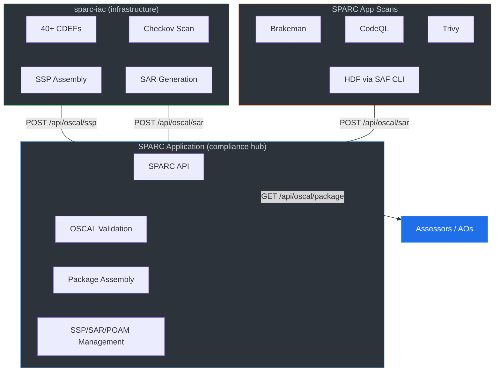

# FedRAMP 20x Implementation for sparc-iac

FedRAMP 20x replaces the traditional manual ATO process with
automation-first, OSCAL-native continuous authorization. This
directory contains the artifacts and pipeline configuration for
implementing FedRAMP 20x on SPARC infrastructure deployments.

## Why FedRAMP 20x for SPARC

SPARC is a compliance platform that manages OSCAL artifacts
(SSP, SAP, SAR, POAM, CDEFs, Profiles, Catalogs) for its
users' systems. Having sparc-iac demonstrate FedRAMP 20x on
its own infrastructure creates a self-referential proof: the
tool that manages your compliance posture is itself compliant,
and you can see exactly how.

### SPARC Application Capabilities (context)

SPARC already handles the full OSCAL v1.1.2 lifecycle:

- **Import**: JSON, XML, YAML, Excel, XCCDF/STIG, InSpec
- **Export**: Validated OSCAL v1.1.2 JSON (schema-checked)
- **Manage**: SSP, SAP, SAR, POAM, CDEF, Profile, Catalog
- **Visualize**: Heat maps, control status dashboards
- **Evidence**: Observations, findings, artifacts, risks
- **Collaborate**: Multi-user inline editing, audit trail

## OSCAL Validation and Document UUIDs

Every committed OSCAL artifact (SSP, SAR, POA&M, SAP, CDEF, resolved catalog)
must validate against the pinned `oscal-cli` build in CI. The gate lives in
`.github/workflows/compliance.yml` (job `validate-oscal`) and runs
`oscal/scripts/validate_oscal.sh` — the same script developers run locally:

```bash
OSCAL_CLI=/path/to/oscal-cli bash oscal/scripts/validate_oscal.sh
```

CI pulls oscal-cli at a pinned version (`OSCAL_CLI_VERSION` in the workflow
env). Bump that variable deliberately when NIST publishes a new release —
changes to metaschema constraints can surface violations that were latent
under the prior validator.

### Document UUID policy

Per the [NIST OSCAL tutorial on document UUIDs][1], the document-root
`uuid` of every OSCAL artifact MUST be regenerated whenever the document's
content changes. SPARC implements this as follows:

- **Document-root UUIDs are UUID v4 (random)**, not v5 (deterministic).
  Generators use `doc_uuid()` in `oscal/scripts/org_config.py`.
- **Sub-document UUIDs (parties, components, info-types, statements,
  observations, risks, etc.) are UUID v5 (deterministic)** via
  `stable_uuid()`. This keeps cross-document references stable across
  regenerations so SSP → SAR → POA&M linkage doesn't churn.
- **Regeneration is content-addressable.** Generators build the document in
  memory, hash everything except `uuid`/`last-modified`/`revisions` via
  `stable_doc_hash()`, and compare to the prior file. If the hash matches,
  the file is left untouched (preserving its UUID and last-modified). If
  it differs, a fresh v4 is minted and the prior UUID is pushed onto
  `metadata.revisions[].props` with `name=previous-uuid` (ns =
  `https://risk-sentinel.io/ns/oscal`).
- **The FedRAMP package skips regeneration when no document changed.**
  `package_fedramp.py` reads change markers written by the generators; if
  no input changed for a pattern, the prior bundle is left in place.

Net effect: the document UUID only moves when actual content moves, and
the full revision history is retained inside each artifact in a form that
OSCAL tooling can read.

The static SAP (`oscal/sap/sparc-assessment-plan.json`) is hand-edited
rather than generated. When you edit it, mint a fresh v4 UUID and record
the prior value in `metadata.revisions[]` with the same `previous-uuid`
prop shape the generators use.

[1]: https://pages.nist.gov/OSCAL/learn/tutorials/general/metadata/#document-uuid

## Resolved profile catalog — link-strip workaround

The NIST-published resolved HIGH-baseline profile catalog
(`NIST_SP-800-53_rev5_HIGH-baseline-resolved-profile_catalog.json`) ships
with dangling `<link>` elements pointing at families that were filtered
out of the profile. These fail the OSCAL 1.1.2 metaschema's
cross-reference constraint. We strip those orphan links as a one-time
import step when the catalog is refreshed — the stripped catalog is what
gets committed. See the commit that introduced this workaround on
`bug/ssp-system-ids` for the specific filter. When NIST publishes a fix
upstream, drop the local strip step.

## Baseline

This implementation uses **NIST SP 800-53 Rev 5 HIGH Impact
Baseline** (370 controls across 18 families):

- Resolved profile catalog:
  `NIST_SP-800-53_rev5_HIGH-baseline-resolved-profile_catalog.json`
- Source: NIST OSCAL Content Repository

## What Exists Today

| FedRAMP 20x Requirement | sparc-iac Status |
| --- | --- |
| OSCAL Component Definitions | 40+ CDEFs (ECS, EC2, Azure) |
| Automated config scanning | Checkov (CI + local) |
| Infrastructure as Code | Terraform (auditable) |
| Control mappings | 800-53 / DISA SRG / CIS |
| Encryption (rest + transit) | KMS CMK, TLS everywhere |
| Continuous monitoring | CloudWatch / Log Analytics |

## Evidence Sources

The FedRAMP 20x package draws evidence from two repositories:

```mermaid
graph TB
    subgraph SPARC["SPARC App (risk-sentinel/sparc)"]
        direction TB
        GL[Gitleaks] -->|SARIF| HDF1[HDF]
        BK[Brakeman] -->|SARIF| HDF2[HDF]
        CQ[CodeQL] -->|SARIF| HDF3[HDF]
        TF[Trivy FS] -->|SARIF| HDF4[HDF]
        TC[Trivy Container] -->|ASFF| HDF5[HDF]
        BA[bundler-audit] -->|JSON| HDF6[HDF]
        SB[CycloneDX SBOMs] -->|SBOM| HDF7[HDF]
        HDF1 & HDF2 & HDF3 & HDF4 & HDF5 & HDF6 & HDF7 -->|OSCAL metadata| ZIP[security-scan-results.zip]
    end

    subgraph IAC["sparc-iac (risk-sentinel/sparc-iac)"]
        direction TB
        CK[Checkov] --> SAR[OSCAL SAR]
        CD[40+ CDEFs] --> SSP[OSCAL SSP]
        AR[Accepted Risks] --> POAM[OSCAL POA&M]
        HP[HIGH Baseline] --> SSP
    end

    ZIP -->|sparc-hdf-latest artifact| CONVERT[the hdf CLI (`hdf convert`)]
    CONVERT --> APPSAR[Application SARs]
    SAR --> PKG[FedRAMP 20x Package]
    SSP --> PKG
    POAM --> PKG
    APPSAR --> PKG
    HP --> PKG

    style SPARC fill:#2d333b,stroke:#58a6ff,color:#c9d1d9
    style IAC fill:#2d333b,stroke:#3fb950,color:#c9d1d9
    style PKG fill:#1f6feb,stroke:#58a6ff,color:#fff
```

## What Will Be Built

### Phase 1: OSCAL Document Assembly

```text
oscal/
+-- ssp/
|   +-- sparc-ecs-ssp.json        (41/370 controls)
|   +-- sparc-ec2-ssp.json        (32/370 controls)
|   +-- sparc-azure-vm-ssp.json   (19/370 controls)
|   +-- *-gaps.txt                 (unaddressed controls)
+-- sap/
|   +-- sparc-assessment-plan.json
+-- sar/
|   +-- sparc-ecs-sar.json        (204 pass / 28 fail)
|   +-- sparc-ec2-sar.json        (179 pass / 31 fail)
|   +-- sparc-azure-vm-sar.json   (53 pass / 18 fail)
+-- poam/
|   +-- sparc-ecs-poam.json       (28 items)
|   +-- sparc-ec2-poam.json       (31 items)
|   +-- sparc-azure-vm-poam.json  (18 items)
+-- scripts/
    +-- assemble_ssp.py            (CDEFs -> SSP)
    +-- checkov_to_oscal.py        (Checkov -> SAR)
    +-- generate_poam.py           (Checkov -> POA&M)
```

- Compose CDEFs into per-pattern SSPs
- Generate SAP defining assessment methodology
- Map each SSP control to its implementing CDEF

### Phase 2: Automated Assessment Pipeline

GitHub Action that runs on every PR/merge:

1. Validate all OSCAL documents against schema
2. Run checkov, convert findings to OSCAL Assessment Results
3. Generate compliance diff (what changed, what controls affected)
4. Publish posture as PR comment or artifact
5. Generate POA&M from accepted risks

### Phase 3: Validation Tool Integration

#### Current: Checkov (static Terraform analysis)

Checkov is the current scanner. A custom `checkov_to_oscal.py`
script converts findings to OSCAL SARs. This converter will be
replaced when SAF CLI ships native Checkov-to-HDF support.

#### Upcoming: SAF CLI Checkov Converter (~April 15, 2026)

MITRE SAF CLI is adding a native `checkov2hdf` converter,
which will unify the pipeline:

```text
Current:  Checkov -> JSON -> checkov_to_oscal.py -> OSCAL SAR
Upcoming: Checkov -> JSON -> SAF CLI checkov2hdf -> HDF -> hdf2oscal -> OSCAL SAR
```

This eliminates the custom converter and routes all scan
results through the same HDF pipeline that SPARC's
application scans already use.

#### Upcoming: HDF v2 with hdf2oscal (~2026)

HDF schema v2 will include native `hdf2oscal` conversion,
making every HDF-producing tool a first-class OSCAL evidence
source. This extends the reach to all SAF CLI converters
(40+ formats) and any tool in the Heimdall ecosystem.

#### Infrastructure Scanning Tools

| Tool | Approach | Output | License | Status |
| --- | --- | --- | --- | --- |
| **Checkov** | Static Terraform analysis | JSON, SARIF | OSS | Implemented |
| **SAF CLI** | HDF conversion + checkov2hdf | HDF → OSCAL | OSS (MITRE) | ~April 2026 |
| **Lula** | OSCAL-native Terraform validation | OSCAL SAR | OSS | Under review |
| **Chef InSpec** | Runtime compliance profiles | HDF via SAF | OSS + Commercial | Under review |
| **Prisma CAS** | Cloud security posture mgmt | SARIF | Commercial | Under review |
| **Trivy** | IaC misconfig + vuln scanning | SARIF, CycloneDX | OSS | Under review |
| **KICS** | Multi-framework IaC scanner | SARIF, CycloneDX | OSS | Under review |
| **Prowler** | Runtime cloud posture (AWS/Azure) | OSCAL, CSV | OSS | Under review |
| **OpenSCAP** | SCAP/XCCDF OS-level compliance | XCCDF | OSS | For EC2 runtime |

#### OSCAL Assembly and Validation

| Tool | Purpose | Status |
| --- | --- | --- |
| **SPARC** | Full OSCAL lifecycle (validate, assemble, manage) | Core hub |
| **SAF CLI** | HDF conversion, OSCAL metadata enrichment | Implemented |
| **Trestle** | OSCAL authoring and assembly | Under review |
| **OSCAL CLI** | Schema validation, format conversion | Under review |

#### Runtime / Continuous Monitoring

| Tool | Approach | Status |
| --- | --- | --- |
| **AWS Security Hub** | Aggregates Config, GuardDuty, Inspector | Under review |
| **Azure Defender** | Cloud-native threat protection | Under review |
| **Prowler** | CIS/NIST checks against live cloud | Under review |
| **OpenSCAP** | OS-level SCAP compliance (EC2) | Under review |

#### Selection Criteria

- OSCAL or HDF output (convertible to OSCAL via SAF CLI)
- Terraform plan/state validation capability
- Runtime vs static analysis coverage
- FedRAMP PMO acceptance as evidence
- Open source preferred, commercial evaluated
- Integration with SPARC application and Heimdall ecosystem

### Phase 4: SPARC API Integration (Bidirectional Loop)

SPARC becomes the compliance control plane — sparc-iac feeds
infrastructure evidence in, SPARC validates and manages it,
assessors consume the complete package from SPARC.



When SPARC's API is available, the compliance pipeline will:

1. Push SSP, SARs, POA&M to SPARC via API
2. SPARC validates all OSCAL against schema
3. SPARC resolves profile and checks completeness
4. Assessors access the validated package in SPARC
5. Continuous: every PR/merge updates the posture

#### Expected SPARC API Endpoints

```text
POST /api/oscal/ssp        Upload assembled SSP
POST /api/oscal/sar        Upload assessment results
POST /api/oscal/poam       Upload plan of action
POST /api/oscal/cdef       Upload component definitions
GET  /api/oscal/validate   Validate uploaded documents
GET  /api/oscal/package    Download complete FedRAMP package
```

### Phase 5: Continuous Authorization

With all phases integrated, the authorization posture updates
automatically:

```text
FedRAMP HIGH Profile (370 controls)
  -> resolved against -> SPARC SSP
    -> satisfied by -> 40+ CDEFs + CSP inheritance + policies
      -> implemented in -> Terraform modules + SPARC app
        -> validated by -> Checkov (now) / SAF CLI (upcoming)
          -> converted to -> HDF -> OSCAL via SAF CLI
            -> pushed to -> SPARC via API
              -> assessed by -> SPARC validation engine
                -> consumed by -> Assessors / Authorizing Officials
```

## Authorization Package Bundle

The compliance pipeline produces a complete FedRAMP 20x
authorization package per deployment pattern. The package
combines infrastructure evidence (from sparc-iac) with
application evidence (from the SPARC app).

### Data Flow

```text
SPARC App (risk-sentinel/sparc)
  security.yml produces:
  +-- Gitleaks -> SARIF -> HDF
  +-- Brakeman -> SARIF -> HDF
  +-- CodeQL -> SARIF -> HDF
  +-- Trivy FS -> SARIF -> HDF
  +-- Trivy Container -> ASFF -> HDF
  +-- CycloneDX SBOMs -> HDF
  +-- All enriched with OSCAL metadata
  +-- Published as artifact: sparc-hdf-latest
        |
        v
sparc-iac (risk-sentinel/sparc-iac)
  compliance.yml consumes:
  +-- Downloads sparc-hdf-latest (cross-repo)
  +-- the hdf CLI (`hdf convert`) converts HDF -> OSCAL SARs
  +-- checkov_to_oscal.py converts findings -> OSCAL SARs
  +-- assemble_ssp.py composes CDEFs -> SSP
  +-- generate_poam.py creates POA&M from risks
  +-- package_fedramp.py bundles everything
        |
        v
  fedramp-package-{pattern}/
```

### Package Contents

```text
fedramp-package-ecs/
+-- manifest.json                    # Package inventory
+-- ssp/
|   +-- sparc-ecs-ssp.json          # System Security Plan
|   +-- sparc-ecs-ssp-gaps.txt      # Unaddressed controls
+-- sap/
|   +-- sparc-assessment-plan.json   # Assessment methodology
+-- sar/
|   +-- infrastructure/
|   |   +-- checkov-sar.json         # Terraform scan results
|   +-- application/
|       +-- brakeman-sar.json        # Rails SAST
|       +-- codeql-sar.json          # Semantic analysis
|       +-- trivy-fs-sar.json        # Filesystem vulns
|       +-- trivy-container-sar.json # Container vulns
|       +-- gitleaks-sar.json        # Secret detection
+-- poam/
|   +-- sparc-ecs-poam.json         # Accepted risks
+-- sbom/
|   +-- sparc-ruby-sbom.json        # Ruby dependencies
|   +-- sparc-container-sbom.json   # Container layers
+-- profile/
    +-- NIST_SP-800-53_rev5_HIGH... # Resolved baseline
```

### SPARC App Integration

The SPARC app needs one addition to publish its HDF
artifacts for sparc-iac to consume:

```yaml
# Add to SPARC's .github/workflows/security.yml
# after the bundle_results job
- name: Publish HDF for sparc-iac
  uses: actions/upload-artifact@v4
  with:
    name: sparc-hdf-latest
    path: hdf/
    retention-days: 90
```

When `sparc-hdf-latest` is available, the compliance
pipeline automatically downloads it, converts HDF to
OSCAL SARs, and includes the results in the FedRAMP
package. When unavailable, the pipeline proceeds with
infrastructure-only evidence.

### Importing into SPARC

The generated OSCAL artifacts (SSP, SAR, POA&M) are valid
OSCAL v1.1.2 JSON and can be imported directly into the
SPARC application for collaborative management:

1. Download the `fedramp-package-{pattern}` artifact
2. In SPARC, import the SSP via the SSP import wizard
3. Import SARs to track assessment results
4. Import POA&M to manage remediation milestones

## Traceability Chain

Every control in the HIGH baseline traces through:

1. **Profile** selects the control (e.g. SC-28)
2. **SSP** declares how the system satisfies it
3. **CDEF** documents the specific implementation
4. **Terraform** configures the resource
5. **Checkov/scanner** validates the configuration
6. **Assessment Results** records the evidence
7. **POA&M** tracks any gaps

## Files in This Directory

| File | Description |
| --- | --- |
| `README.md` | This file |
| `NIST_SP-800-53_rev5_HIGH-baseline-resolved-profile_catalog.json` | NIST HIGH baseline (370 controls, 18 families) |

## Phase Status

| Phase | Status | Notes |
| --- | --- | --- |
| 1: OSCAL Assembly | Complete | SSPs, SAP, SARs, POAMs generated |
| 2: CI Pipeline | Complete | compliance.yml validates on every PR/push |
| 3: Validation Tools | In progress | Checkov now; SAF CLI checkov2hdf ~April 2026; HDF v2 hdf2oscal upcoming |
| 4: SPARC API | Planned | Bidirectional loop when API is available |
| 5: Continuous Auth | In progress | Pipeline runs, coverage expanding |

## Related

- [`docs/CDEF_Guide.md`](../CDEF_Guide.md) — How CDEFs work
- [`docs/checkov/`](../checkov/configuration_checks.md) — Current scan results
- [SPARC application](https://github.com/risk-sentinel/sparc) — The compliance platform
- [NIST OSCAL](https://pages.nist.gov/OSCAL/) — OSCAL framework
- [FedRAMP 20x](https://www.fedramp.gov/20x/) — Modernization initiative
