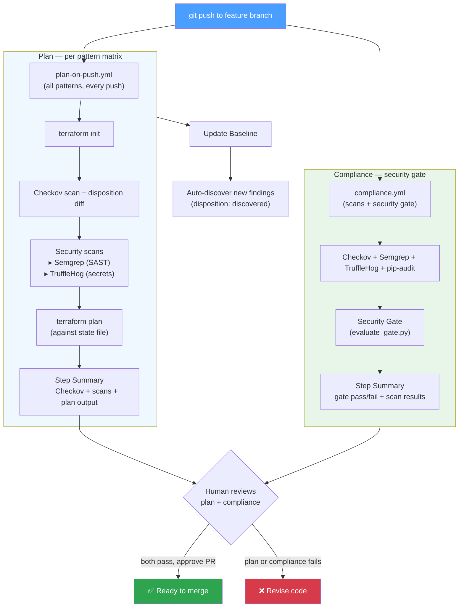
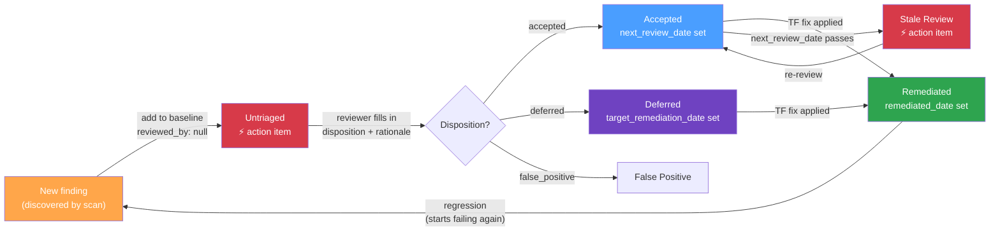
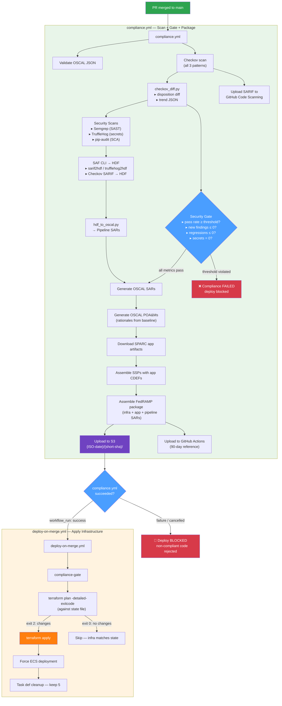
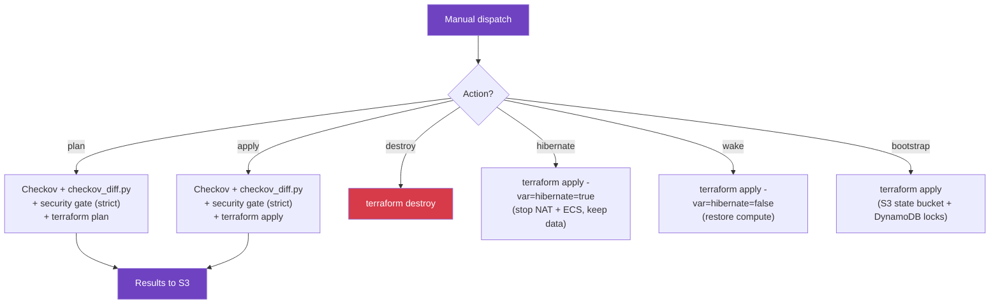
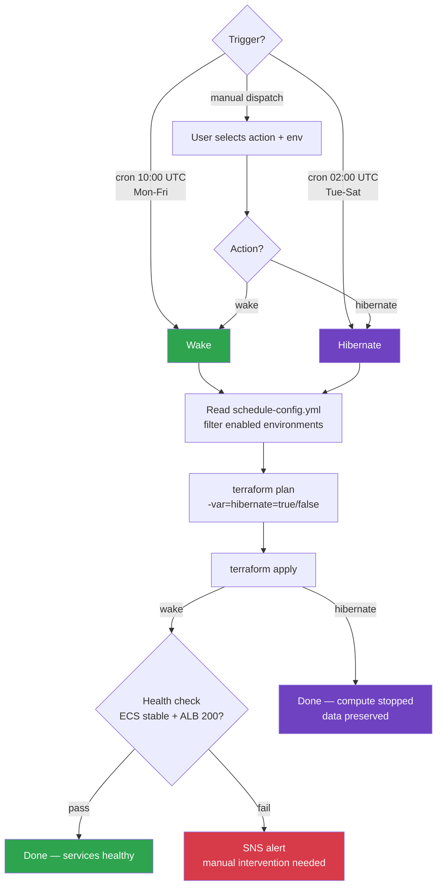

# CI/CD Pipeline Flow

## Overview

```text
Push to feature branch ──► Merge PR to main ──► Manual operations
(fast feedback)            (deploy + comply)     (bootstrap/hibernate/wake/destroy)
```

## Push to Feature Branch / Pull Request

Triggered by: any push to non-main branches. Two workflows run in parallel:
- **plan-on-push.yml** — terraform plan for all patterns (plan output for human review)
- **compliance.yml** — security scans + gate (compliance status for human review)

Both must be visible before the human approves the PR.



**Workflow:** `plan-on-push.yml`
**Purpose:** Fast feedback — what changed and is it secure?
**Outputs:** GitHub Actions step summary (ephemeral)

---

## Checkov Baseline Lifecycle

The `checkov-baseline.yml` file tracks every finding through its lifecycle:



**Find action items:**

```bash
grep "reviewed_by: null" checkov-baseline.yml    # untriaged
grep "null" checkov-baseline.yml                 # all action items
```

---

## Merge PR to Main

Triggered by: push to `main` (i.e., PR merge). Compliance runs first; deploy only proceeds if compliance passes.



**Flow:** PR approval is the deploy approval. On merge to main: compliance runs all scans →
security gate evaluates thresholds → if gate passes, OSCAL packaging proceeds →
compliance.yml succeeds → `workflow_run` triggers deploy-on-merge.yml →
terraform plan -detailed-exitcode against state file → if changes exist, apply.

No git diff. No change detection. Terraform plan is the only source of truth.
If any threshold is violated, compliance fails and deploy is blocked.

---

## S3 Artifact Structure (merge only)

```text
s3://your-security-artifacts-bucket/
└── 2026-03-25/
    └── bfd50d4/
        ├── checkov-ecs-1711295400.json       ← Checkov raw results
        ├── checkov-ecs-1711295400.sarif       ← Checkov SARIF
        ├── checkov-trend-ecs.json             ← Disposition trend (new)
        ├── ecs-ssp.json                       ← System Security Plan
        ├── ecs-sar.json                       ← Security Assessment Results
        ├── ecs-poam.json                      ← Plan of Action & Milestones
        ├── application-sars/                  ← SPARC app scan results
        │   └── *.json
        └── fedramp-package-ecs/               ← Complete FedRAMP bundle
            └── ...
```

Lifecycle: Standard → Infrequent Access (90d) → Glacier (365d)

---

## Manual Operations

Triggered by: `workflow_dispatch` (manual button in GitHub Actions).



**Workflow:** `deploy.yml`
**Purpose:** Non-routine operations — bootstrap, hibernate, wake, destroy, ad-hoc plan/apply.

---

## Scheduled Hibernate/Wake

Triggered by: cron schedule (weekdays) or `workflow_dispatch` (manual override).



**Workflow:** `schedule-hibernate.yml`
**Config:** `schedule-config.yml` (opt-in per environment, prod disabled by default)
**Savings:** ~$47/month (dev+staging on weekday schedule)

---

## Workflow Responsibility Matrix

| Concern | plan-on-push | compliance | deploy-on-merge | deploy (manual) | schedule-hibernate |
| - | - | - | - | - | - |
| **Trigger** | Every push to feature branch | PR + merge to main | After compliance passes (workflow_run) | Manual dispatch | Cron (weekdays) or manual |
| **Terraform plan** | Always (all patterns) | No | Always (-detailed-exitcode) | Yes | Yes (logged) |
| **Terraform apply** | No | No | If plan shows changes | Yes | Yes (hibernate var) |
| **Checkov scan** | Yes (all patterns) | Yes (full + OSCAL) | No | Yes | No |
| **Disposition diff** | Yes | Yes | No | Yes | No |
| **Security gate** | Yes (threshold.yml) | Yes (evaluate_gate.py) | No | Yes (strict mode) | No |
| **Security scans** | Semgrep + TruffleHog | Semgrep + TruffleHog + pip-audit (once) | No | No | No |
| **OSCAL generation** | No | Yes | No | No | No |
| **FedRAMP package** | No | Yes | No | No | No |
| **S3 artifacts** | No | Yes | No | Yes | No |
| **Performance tracking** | No | Yes (chart + compare) | No | No | No |
| **Auto-baseline update** | Yes (discovered findings) | No | No | No | No |
| **ECS force-deploy** | No | No | If plan applied | No | No |
| **Health check** | No | No | No | No | Yes (wake only) |
| **SNS on failure** | No | No | No | No | Yes |

---

## Job Timeout Limits

All jobs have `timeout-minutes` set to prevent stuck runners from burning CI minutes.
Limits are based on empirical data from `pipeline-baseline.json` (117 runs, ~3x observed max).

| Workflow | Job | Observed Max | Timeout |
| - | - | - | - |
| **plan-on-push** | Plan (per pattern) | 1.8 min | 5 min |
| **plan-on-push** | Update Baseline | < 1 min | 5 min |
| **compliance** | Validate OSCAL | < 1 min | 5 min |
| **compliance** | Security Scans | < 1 min | 5 min |
| **compliance** | Checkov Scan (per pattern) | 4.9 min | 10 min |
| **compliance** | Upload to S3 | < 1 min | 5 min |
| **compliance** | Performance Tracking | < 1 min | 5 min |
| **deploy-on-merge** | Compliance Gate | < 1 min | 5 min |
| **deploy-on-merge** | Deploy ECS | 1.2 min | 15 min |
| **validate** | Terraform (per pattern) | < 1 min | 5 min |
| **validate** | OSCAL Documents | < 1 min | 5 min |
| **deploy** | Validate | < 1 min | 5 min |
| **deploy** | Checkov | < 5 min | 10 min |
| **deploy** | Deploy (ECS/EC2/Azure) | < 2 min | 20 min |
| **deploy** | Bootstrap | < 1 min | 10 min |
| **schedule-hibernate** | Resolve Action | < 1 min | 5 min |
| **schedule-hibernate** | Hibernate/Wake | < 5 min | 15 min |
