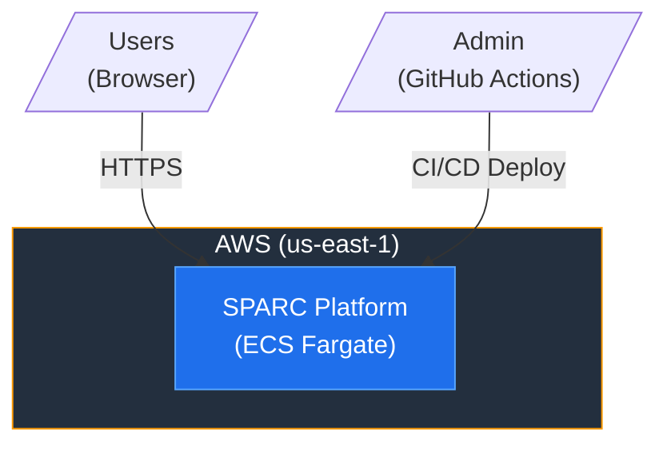
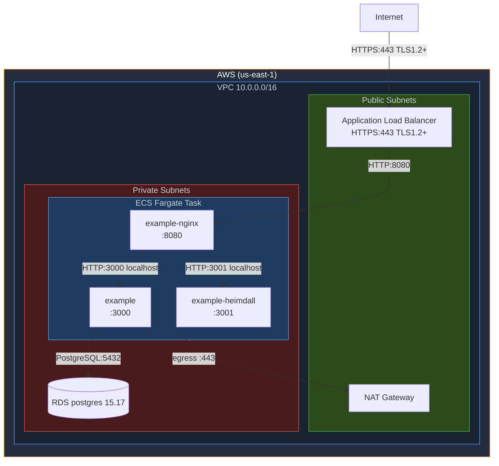
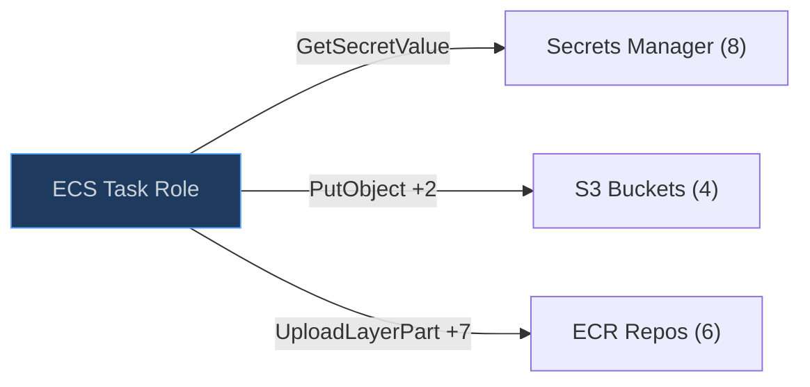
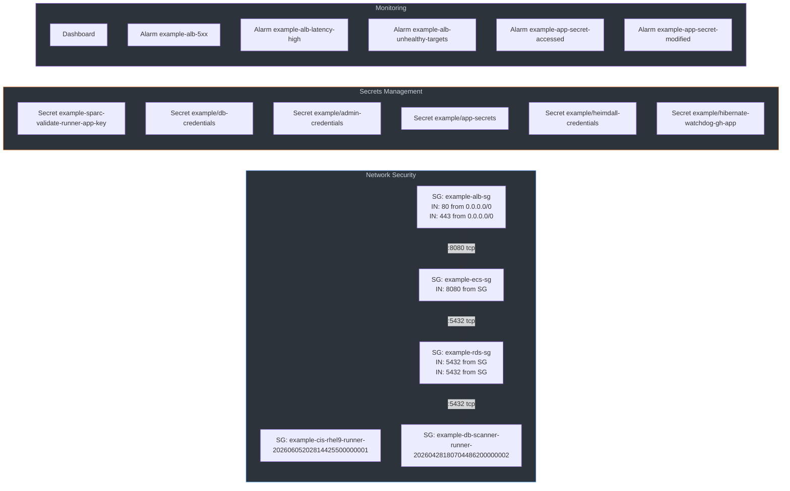
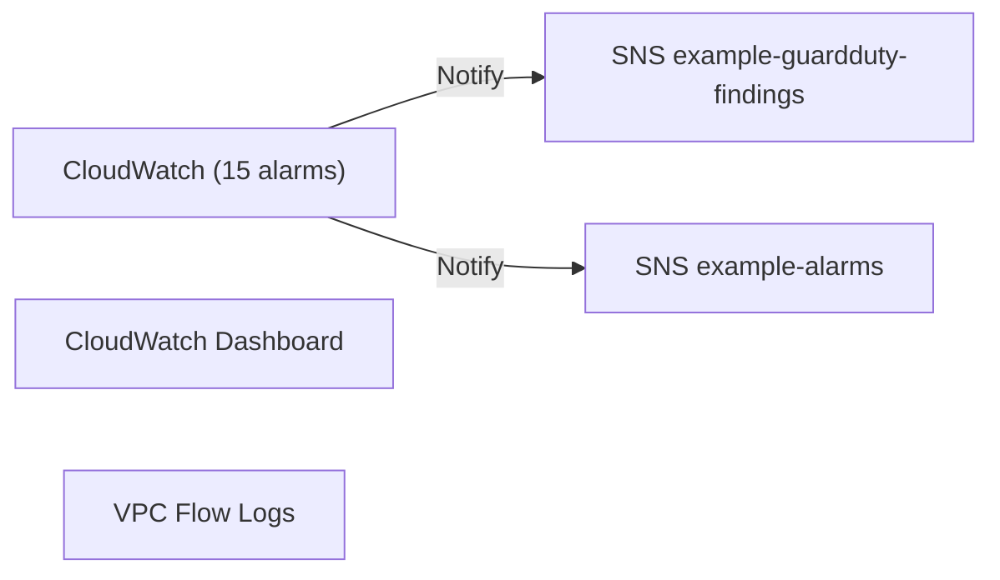
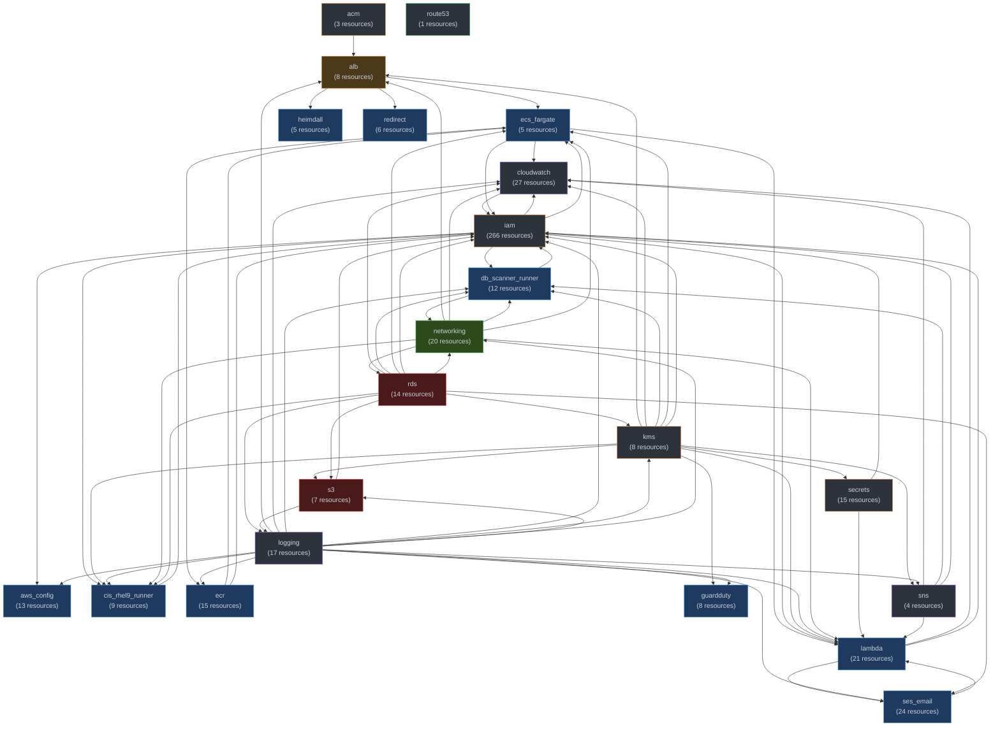

# SPARC ECS Fargate — Architecture Diagram

## System Context (C4 Level 1)

## Data-Plane Flow (C4 Level 2)

## Data & Secrets Access

## Security Architecture

## Observability

## Boundary Reference (FedRAMP SC-7)

| Source → Dest | Port | Protocol | TLS | Source SG → Dest SG | ARN Template | IAM Action |
| --- | --- | --- | --- | --- | --- | --- |
| ECS Task → ECR heimdall2 | — | — | — | — | arn:aws:ecr:<region>:<account>:repository/heimdall2 | UploadLayerPart +7 |
| ECS Task → ECR sparc-auditor | — | — | — | — | arn:aws:ecr:<region>:<account>:repository/sparc-auditor | UploadLayerPart +7 |
| ECS Task → ECR sparc-ci-runner | — | — | — | — | arn:aws:ecr:<region>:<account>:repository/sparc-ci-runner | UploadLayerPart +7 |
| ECS Task → ECR example | — | — | — | — | arn:aws:ecr:<region>:<account>:repository/example | GetDownloadUrlForLayer +2 |
| ECS Task → ECR example-nginx | — | — | — | — | arn:aws:ecr:<region>:<account>:repository/example-nginx | UploadLayerPart +7 |
| ECS Task → ECR vulcan | — | — | — | — | arn:aws:ecr:<region>:<account>:repository/vulcan | UploadLayerPart +7 |
| ECS Task → S3 example-audit-logs | — | — | — | — | arn:aws:s3:::example-audit-logs | GetBucketAcl |
| ECS Task → S3 your-security-artifacts-bucket | — | — | — | — | arn:aws:s3:::your-security-artifacts-bucket | PutObject +2 |
| ECS Task → S3 example-ses-inbound | — | — | — | — | arn:aws:s3:::example-ses-inbound | ListAllMyBuckets |
| ECS Task → S3 example-uploads | — | — | — | — | arn:aws:s3:::example-uploads | ListBucket |
| ECS Task → Secret example-sparc-validate-runner-app-key | — | — | — | — | arn:aws:secretsmanager:<region>:<account>:secret:example-sparc-validate-runner-app-key-* | GetSecretValue |
| ECS Task → Secret example/SPARC_HASH | — | — | — | — | arn:aws:secretsmanager:<region>:<account>:secret:example/SPARC_HASH-EXAMPLE0002 | GetSecretValue |
| ECS Task → Secret example/admin-credentials | — | — | — | — | arn:aws:secretsmanager:<region>:<account>:secret:example/admin-credentials-EXAMPLE0003 | UpdateSecretVersionStage +3 |
| ECS Task → Secret example/app-secrets | — | — | — | — | arn:aws:secretsmanager:<region>:<account>:secret:example/app-secrets-EXAMPLE0005 | GetSecretValue |
| ECS Task → Secret example/db-credentials | — | — | — | — | arn:aws:secretsmanager:<region>:<account>:secret:example/db-credentials-EXAMPLE0007 | GetSecretValue |
| ECS Task → Secret example/heimdall-credentials | — | — | — | — | arn:aws:secretsmanager:<region>:<account>:secret:example/heimdall-credentials-EXAMPLE0008 | GetSecretValue |
| ECS Task → Secret example/hibernate-watchdog-gh-app | — | — | — | — | arn:aws:secretsmanager:<region>:<account>:secret:example/hibernate-watchdog-gh-app-EXAMPLE0009 | GetSecretValue |
| ECS Task → Secret example/rotation-lambda-token | — | — | — | — | arn:aws:secretsmanager:<region>:<account>:secret:example/rotation-lambda-token-EXAMPLE0010 | GetSecretValue |
| Internet → ALB | 443 | HTTPS | TLS1.2+ | 0.0.0.0/0 → ALB SG | — | — |
| example-alb-sg → example-ecs-sg | 8080 | tcp | — | SG: example-alb-sg → SG: example-ecs-sg | — | — |
| example-ecs-sg → example-rds-sg | 5432 | tcp | — | SG: example-ecs-sg → SG: example-rds-sg | — | — |
| example-rds-sg → example-db-scanner-runner | 5432 | tcp | — | SG: example-rds-sg → SG: example-db-scanner-runner-20260428180704486200000002 | — | — |

## Module Dependency Graph

---
*Auto-generated from Terraform state on 2026-09-21T09:03:58Z. 508 resources, 303 connections detected. Do not edit manually.*
