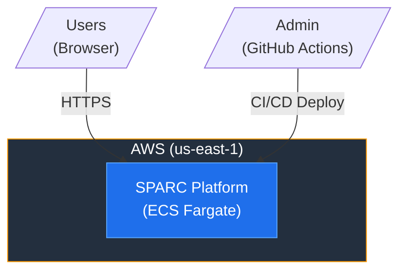
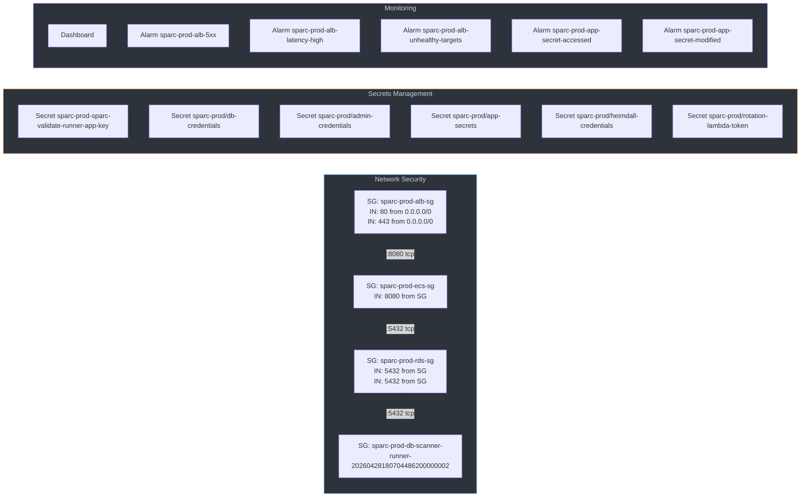
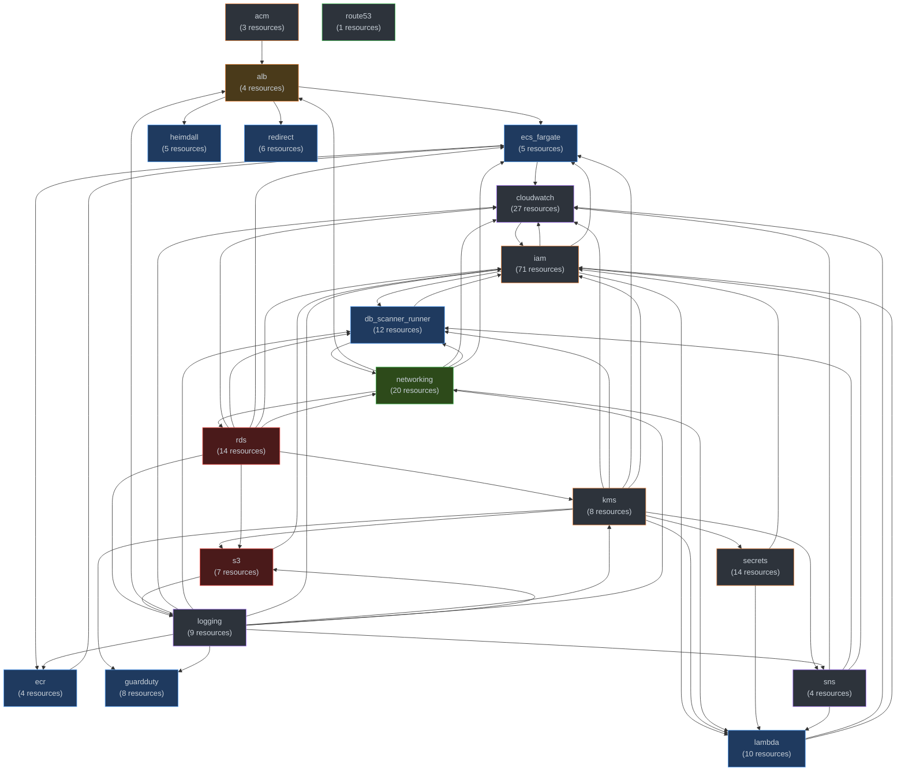

# SPARC ECS Fargate — Architecture Diagram

## System Context (C4 Level 1)

## Container Diagram (C4 Level 2)

```mermaid
graph TB
    Internet["Internet"]

    subgraph Cloud["AWS (us-east-1)"]
        subgraph VPC["VPC 10.0.0.0/16"]
            subgraph Public["Public Subnets"]
                alb_aws_lb_main["Application Load Balancer<br/>:443 HTTPS / :80 redirect"]
                networking_aws_nat_gateway_main["NAT Gateway"]
            end
            subgraph Private["Private Subnets"]
                ecs_fargate_aws_ecs_cluster_main["ECS Cluster"]
                ecs_fargate_aws_ecs_service_main["ECS Service"]
                ecs_fargate_aws_ecs_task_definition_main["Fargate Task"]
                rds_aws_db_instance_main[("RDS postgres 15.17")]
            end
        end

        acm_aws_route53_record_validation["DNS _9f60ca7e55ec9452c87d4734ef39ca17.sparc.risk-sentinel..."]
        heimdall_aws_route53_record_heimdall["DNS heimdall.example.com (A)"]
        heimdall_aws_route53_record_heimdall_cert_validation["DNS _3025e02650430ff24d7d507349f9b1d8.heimdall.risk-senti..."]
        redirect_aws_route53_record_redirect["DNS sparc.example.net (A)"]
        redirect_aws_route53_record_validation["DNS _eca81d849060acffa0d94d6cf871fbbc.sparc.risk-sentinel..."]
        route53_aws_route53_record_app["DNS sparc.example.com (A)"]
        acm_aws_acm_certificate_main["ACM Certificate"]
        db_scanner_runner_aws_secretsmanager_secret_runner_app_key["Secret sparc-prod-sparc-validate-runner-app-key"]
        heimdall_aws_acm_certificate_heimdall["ACM Certificate"]
        kms_aws_kms_key_data["KMS Key"]
        kms_aws_kms_key_logs["KMS Key"]
        kms_aws_kms_key_secrets["KMS Key"]
        rds_aws_secretsmanager_secret_db["Secret sparc-prod/db-credentials"]
        redirect_aws_acm_certificate_redirect["ACM Certificate"]
        secrets_aws_secretsmanager_secret_admin["Secret sparc-prod/admin-credentials"]
        secrets_aws_secretsmanager_secret_app["Secret sparc-prod/app-secrets"]
        secrets_aws_secretsmanager_secret_heimdall["Secret sparc-prod/heimdall-credentials"]
        secrets_aws_secretsmanager_secret_rotation_lambda_token["Secret sparc-prod/rotation-lambda-token"]
        secrets_aws_secretsmanager_secret_sparc_hash["Secret sparc-prod/SPARC_HASH"]
        ecr_aws_ecr_repository_main["ECR sparc-prod"]
        ecr_aws_ecr_repository_nginx["ECR sparc-prod-nginx"]
        logging_aws_s3_bucket_artifacts["S3 your-security-artifacts-bucket"]
        s3_aws_s3_bucket_uploads["S3 sparc-prod-uploads"]
        cloudwatch_aws_cloudwatch_dashboard_main["Dashboard"]
        cloudwatch_aws_cloudwatch_metric_alarm_alb_5xx["Alarm sparc-prod-alb-5xx"]
        cloudwatch_aws_cloudwatch_metric_alarm_alb_latency["Alarm sparc-prod-alb-latency-high"]
        cloudwatch_aws_cloudwatch_metric_alarm_alb_unhealthy["Alarm sparc-prod-alb-unhealthy-targets"]
        cloudwatch_aws_cloudwatch_metric_alarm_app_secret_access["Alarm sparc-prod-app-secret-accessed"]
        cloudwatch_aws_cloudwatch_metric_alarm_app_secret_modify["Alarm sparc-prod-app-secret-modified"]
        cloudwatch_aws_cloudwatch_metric_alarm_ecs_cpu["Alarm sparc-prod-ecs-cpu-high"]
        cloudwatch_aws_cloudwatch_metric_alarm_ecs_memory["Alarm sparc-prod-ecs-memory-high"]
        cloudwatch_aws_cloudwatch_metric_alarm_nginx_5xx_rate["Alarm sparc-prod-nginx-5xx-rate"]
        cloudwatch_aws_cloudwatch_metric_alarm_rails_error_rate["Alarm sparc-prod-rails-error-rate"]
        cloudwatch_aws_cloudwatch_metric_alarm_rds_connections["Alarm sparc-prod-rds-connections-high"]
        cloudwatch_aws_cloudwatch_metric_alarm_rds_cpu["Alarm sparc-prod-rds-cpu-high"]
        cloudwatch_aws_cloudwatch_metric_alarm_rds_storage["Alarm sparc-prod-rds-storage-low"]
        db_scanner_runner_aws_cloudwatch_metric_alarm_stuck_runner["Alarm sparc-prod-db-scanner-runner-stuck"]
        guardduty_aws_sns_topic_findings["SNS sparc-prod-guardduty-findings"]
        sns_aws_sns_topic_alarms["SNS sparc-prod-alarms"]
    end

    Internet -->|DNS| acm_aws_route53_record_validation
    acm_aws_route53_record_validation -->|Alias| alb_aws_lb_main
    alb_aws_lb_main -->|:8080| ecs_fargate_aws_ecs_cluster_main
    ecs_fargate_aws_ecs_cluster_main -->|:5432 SSL| rds_aws_db_instance_main
    ecs_fargate_aws_ecs_cluster_main -->|IAM role| logging_aws_s3_bucket_artifacts
    ecs_fargate_aws_ecs_cluster_main -->|GetSecretValue| db_scanner_runner_aws_secretsmanager_secret_runner_app_key
    ecs_fargate_aws_ecs_cluster_main -->|Pull images| ecr_aws_ecr_repository_main
    ecs_fargate_aws_ecs_cluster_main -->|Outbound| networking_aws_nat_gateway_main
    cloudwatch_aws_cloudwatch_dashboard_main -->|Alerts| guardduty_aws_sns_topic_findings
    rds_aws_db_instance_main -.->|Metrics| cloudwatch_aws_cloudwatch_dashboard_main
    ecs_fargate_aws_ecs_cluster_main -.->|Logs + Metrics| cloudwatch_aws_cloudwatch_dashboard_main

    style Cloud fill:#232f3e,stroke:#ff9900,color:#fff
    style VPC fill:#1a2332,stroke:#58a6ff,color:#c9d1d9
    style Public fill:#2d4a1a,stroke:#3fb950,color:#c9d1d9
    style Private fill:#4a1a1a,stroke:#f85149,color:#c9d1d9
```

## Security Architecture

## Module Dependency Graph

---
*Auto-generated from Terraform state on 2026-05-23T18:26:03Z. 232 resources, 207 connections detected. Do not edit manually.*
